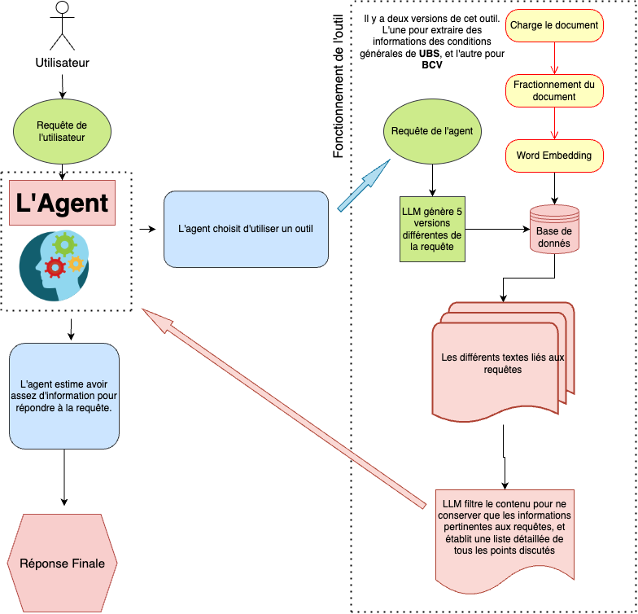

# UBS vs BCV: Comparateur de conditions générales

UBS vs BCV est une application d'intelligence artificielle, exploitant les capacités de [LangChain](https://python.langchain.com/docs/get_started/introduction.html), [OpenAI](https://openai.com/) et [DeepLake](https://www.deeplake.ai/), qui vous permet de comparer les conditions générales des deux banques Suisses: UBS et BCV.

## Documents comparés
- UBS: [Conditions générales UBS (PDF)](https://www.ubs.com/global/fr/legal/country/switzerland/legalnotices/_jcr_content/mainpar/toplevelgrid_644694947/col1/linklist_411753453/link.1566204240.file/PS9jb250ZW50L2RhbS9hc3NldHMvY2MvZ2xvYmFsL2xlZ2FsL2RvYy9nZW5lcmFsLXRlcm1zLWFuZC1jb25kaXRpb25zLWZyLnBkZg==/general-terms-and-conditions-fr.pdf)
- BCV: [Conditions générales BCV (PDF)](https://www.bcv.ch/content/dam/bcv/fichiers/conditions/03008FR_2.pdf)

## Démonstration
Pour une meilleure compréhension des capacités de cette application, je vous encourage à essayer la démo disponible sur [Streamlit](https://ubsvsbcv-lwjyvkqecky5zvqu3hhhhy.streamlit.app/):
https://ubsvsbcv-lwjyvkqecky5zvqu3hhhhy.streamlit.app/

Un exemple de question que vous pourriez poser est : 
*Quelle est la différence entre le secret bancaire de UBS et BCV?*

## Comment ça marche?

Cette application démontre comment créer un agent conversationnel qui travaille en français. L'agent a accès à deux outils: un pour extraire des informations des conditions générales de UBS et un autre pour BCV.

Ces outils sont de type "RetrievalQA" - une chaîne qui répond à des questions relatives aux documents fournis par l'utilisateur, utilisant "MultiQueryRetriever" pour générer cinq versions différentes de la question, permettant de surmonter certaines limites de la recherche de similarité basée sur la distance.

En d'autres termes, lorsque l'agent pose une question à un outil, l'outil (un autre modèle de langage à grande échelle - LLM) crée cinq variantes de cette question. Ces variantes sont ensuite utilisées pour chercher des textes liés à ces questions dans une base de données structurée sous forme de word embedding. Le LLM filtre ensuite le contenu pour ne conserver que les informations pertinentes aux questions, et établit une liste détaillée de tous les points discutés dans ces textes. C'est ensuite à l'agent de décider s'il veut utiliser d'autres outils ou alors  donner sa réponse finale.

La base de données est stockée chez DeepLake.

## Déploiement
Pour déployer vous-même cette application, vous aurez besoin des clés API de OpenAI et DeepLake.

## Prochaines étapes
On peut imaginer l'implémentation d'une chaîne de vérification. Cette chaîne aura pour but de combattre les hallucinations occasionnelles du modèle de langage à grande échelle (LLM), qui peuvent conduire à des informations incorrectes ou mal interprétées.

La chaîne de vérification pourra confirmer que la réponse finale de l'agent provient réellement des informations trouvées dans les documents comparés, garantissant ainsi l'exactitude et la fiabilité des informations fournies.
